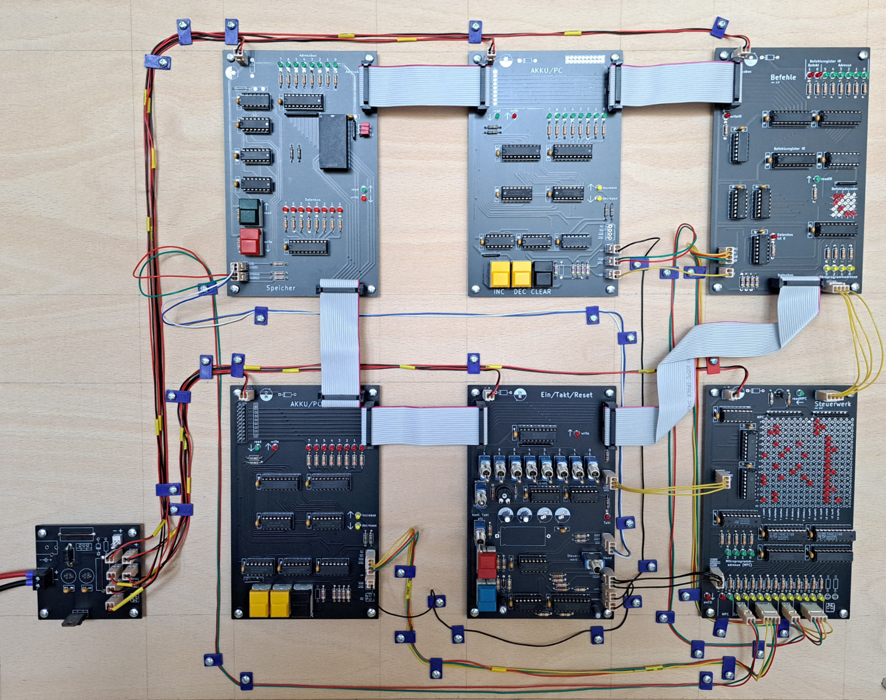

# Bonsai-Modellcomputer
Der Bonsai-Modellcomputer wurde von Klaus Merkert für den Einsatz im Informatikunterricht entwickelt. Auf folgender Seite findet man unter anderem Schaltpläne und Platinenlayouts von Klaus Merkert zum Bau eines Bonsai-Modellcomputers:
http://www.hsg-kl.de/faecher/inf/material/bonsai/

Es gibt auch eine Simulation des Lerncomputers (https://bonsai.pinyto.de/), die im digitalen Informatik-Schulbuch http://inf-schule.de verwendet wird.

Viele Bauteile, die in den Plänen von Klaus Merkert verwendet werden, wurden abgekündigt und sind heue (Stand 2021) nicht mehr verfügbar.
Ziel dieses Projektes ist es deshalb, eine Version des Bonsai-Modellcomputer zu entwickeln, die möglichst leicht nachgebaut werden kann.

# Projekstatus
Der Prototyp funktioniert und wurde im Unterricht eingesetzt. In den Github-Issues sind einige kleinere Probleme beschrieben, die vor einem weiteren Nachbau behoben werden könnten.

# Änderungen gegenüber den Plänen von Klaus Merkert
- Die Namen und Reihenfolge der Steuersignale wurden an den Simulator angepasst (vgl. https://bonsai.pinyto.de/documentation/micro/)
- Alle Schaltpläne und Platinen wurden mit der Software KiCad gezeichnet (http://kicad.org).
- Für die Platinen wurden neue Layouts entwickelt, damit die Möglichkeiten eines doppelseitigen Layouts besser genutzt werden können.
- Die Steckverbinder zur Verbindung der Steuersignale sowie der Spannungsversorgung mit den Platinen wurden ersetzt durch Reichelt PSK (Alternativ kann man Molex KK verwenden. Diese Steckverbinder sind besser, aber auch deutlich teurer).
- Alle Bauteile der Familie 74LS wurden durch Bauteile der Familien 74HC oder 74HCT ersetzt.
- Zur Nullentdeckung auf der Platine Befehle wurde eine Wired-And-Verknüpfung mit Open-Collector-Ausgängen verwendet. Diese Wired-And-Verknüpfung wurde durch Gatter in einem 74HC08 ersetzt.
- Zur Erzeugung eines automatischen Taktsignals wird ein Mikrocontroller (Atmega 48-20P) verwendet. Der Quellcode liegt im Verzeichnis EinTaktReset-src. Der Quellcode kann mit dem Microchip Studio compiliert werden. Der Mikrocontroller kann anschließend über den ISP-Header auf der Platine EinTaktReset programmiert werden.

# Eine Bonsai nachbauen
## Beschaffung der Bauteile
- Flachbandkabel: Diese Flachbandkabel kann man aus IDE-Kabeln herstellen.
- Taster Digitast: Diese Schalter sind in den letzten Jahren sehr teuer geworden (ca. 5€ pro Taster). Kompatible Nachbauten findet man auf der Seite https://de.aliexpress.com/ unter der Bezeichnung PB86. Zur Sicherheit: Datenblatt (insbesondere Abmessungen und interne Schaltung) prüfen!
- Die Steckverbinder 

## Platinen fertigen lassen
Die Pläne wurden mit KiCad gezeichnet. In den *.kicad_sch-Dateien befinden sich die Schaltpläne, die Platinenlayouts sind in den *.kicad_pcb-Dateien. Um die Platinen fertigen zu lassen, muss man das Platinenlayout in ein Format exportieren, dass der Hersteller versteht. In der Regel ist das Gerber. Die Gerber-Exporte, die bei dem Prototypen verwendet wurden, liegen im Verzeichnis gerber. Diese Gerber-Dateien wurden von https://jlcpcb.com/ problemlos gefertigt.

## Platinen bestücken
Es werden nur bedrahtete Bauteile (keine SMD-Bauteile) verwendet, da bedrahtete Bauteile von Lötanfängern (z.B. Schülern) leichter bestückt werden können. Es ist sinnvoll, bei allen ICs je einen Sockel zu verwenden.

Der Bestückungsdruck der Platinen wird für Hinweise zur Bedienung des Rechners verwendet.
Die Bezeichnungen der Bauteile stehen nicht im Bestückungsdruck.
Man erfährt diese Bezeichnungen, indem man das KiCad-Projekt zu der Platinen, an der man gerade arbeitet, betrachtet. Dazu öffnet man zunächst die Projektdatei (.kicad_pro). Aus der Kicad-Projektansicht kann man dann den Schaltplan und das Board mit einem Doppelclick öffnen. Wenn man die Dateien so öffnet, sind Schaltplan und Board verknüpft. D.h.: Klickt man im Schaltplan / Board auf ein Bauteil, so wird dieses Bauteil automatisch auch im Bard / Schaltplan hervorgehoben. So versteht man leichter, welche Aufgabe ein bestimmtes Bauteil auf dem Board hat. 

Es empfiehlt sich, die Platinen in der folgenden Reihenfolge zu bestücken:
- Spanngsversorgung (KiCad-Projekt power-schmal). Diese Platine wird später benötigt, um andere Platinen zu testen.
- Akku und PC. Diese Platinen können einzeln getestet werden. Achtung: Die Platinen sind gleich, sie unterscheiden sich jedoch in der Farbe der LEDs und den Widerständen R2 und R2 (vgl. Schaltplan sowie [Bonsai.jpg](Bonsai.jpg))
- Speicher
- Ein/Takt/Reset. Nun können alle bisher gebauten Platinen gemeinsam getestet werden. Man verkabelt die Platinen. Dann kann man mit den Kippschaltern Zahlen eingeben, diese Zahlen speichern und anschließend wider auf den Datenbus schreiben.
- restliche Platinen

## Platine Ein/Takt/Reset
Von dieser Platine gibt es eine neue Version. Im Bild [Bonsai.jpg](Bonsai.jpg) ist noch die alte Version abgebildet. In der neuen Version wird der Takt von einem Mikrocontroller (ATmega48) erzeugt. Dieser Controller muss programmiert werden. Die Programmierung kann direkt in der Schaltung mit Hilfe der 6-poligen Pinleiste erfolgen. Man benötigt dazu einen ISP-Adapter für ATmega-Controller. Der Quellcode befindet sich im Ordner EinTaktReset-src.

## Platinen verdrahten
Bei der Verdrahtung kann man sich orientieren
- [am Bild des Computers](Bonsai.jpg)
- [Verdrahtung](Verdrahtung.svg) Tipp: Datei in Inkscape öffnen; die Datei ist im Maßstab 1:1 gezeichnet
- an der Verdrahtungsanleitung von Klaus Merkert (https://www.hsg-kl.de/faecher/inf/material/bonsai/bau/verdraht/index.php)

Crimpanleitung für die Steckverbinder Reichelt PSK: https://www.reichelt.de/reicheltpedia/index.php/Crimp_Anleitungen#Crimpen_von_PSK-Kontakten

Als Flachbandkabel kann man alte IDE-Kabel verwenden. Mann muss jedoch einige Leitungen abtrennen und neue Stecker crimpen.

Die Kabelhalter können mit einem 3D-Drucker gedruckt werden. Eine OpenSCAD-Datei befindet sich im Ordner Kabelhalter: [Kabelhalter.scad](Kabelhalter/Kabelhalter.scad)

## Spannungsversorgung
Der Bonsai läuft mit einer Gleichspannung von 5V. Es mehrere Möglichkeiten, wie man diese Spannung bereitstellen kann:

- Man verwendet ein Festspannungsnetzteil, das 5V ausgibt. Aus Lochrasterplatinenmaterial baut man eine Platine, auf der sich eine Buchse für das Netzteil sowie sechs 2-polige Steckerleisten für 2-polige PSK-Stecker befinden (pro Platine eine Steckerleiste).
- Man baut eine kleine Platine mit einem Festspannungsregler (7805). Dazu kann man z.B. die Platine im Ordner power-schmal verwenden. Diese Platine benötigt eine Eingangsspannung, die irgendwo zwischen ca. 7V und ca. 15V liegen sollte. Dazu kann man z.B. ein Labornetzgerät verwenden.  Das Labornetzgerät hat gegenüber einem Steckernetzteil den Vorteil, dass man die Stromstärke an dem Netzteil ablesen kann und so eine kontrolle hat, ob der Bonsai richtig funktioniert. Bei dem vollständigen Bonsai liegt die Stromstärke (je nach dem, wie viele LEDs gerade leuchten und welche Vorwiderstände für die LEDs verwendet wurden) bei ca. 50mA - 300mA.

## Helligkeit der LEDs
Die Leds sind sehr hell. Bei einem Nachbau könnte man größere Vorwiderstände verwenden. Nach der Anschaffung der LEDs könnte man die Helligkeit einer LED bei verschiedenen Vorwiderständen ausprobieren (Led in Reihe schalten mit Vorwiderstand) und dann festlegen, welchen Vorwiderstand man verwendet.

Bei LEDs, die von einem Pin eines 74HCXX getrieben werden, sollte der Vorwiderstand mindestens 600Ohm betragen, wenn man innerhalb der Empfehlungen von TI bleiben möchte (vgl. Issue #5). Dies gilt jedoch nicht für LEDs, die von einem 74HC540 oder 74HC541 getrieben werden, da diese beiden ICs Leistungstreiber sind.