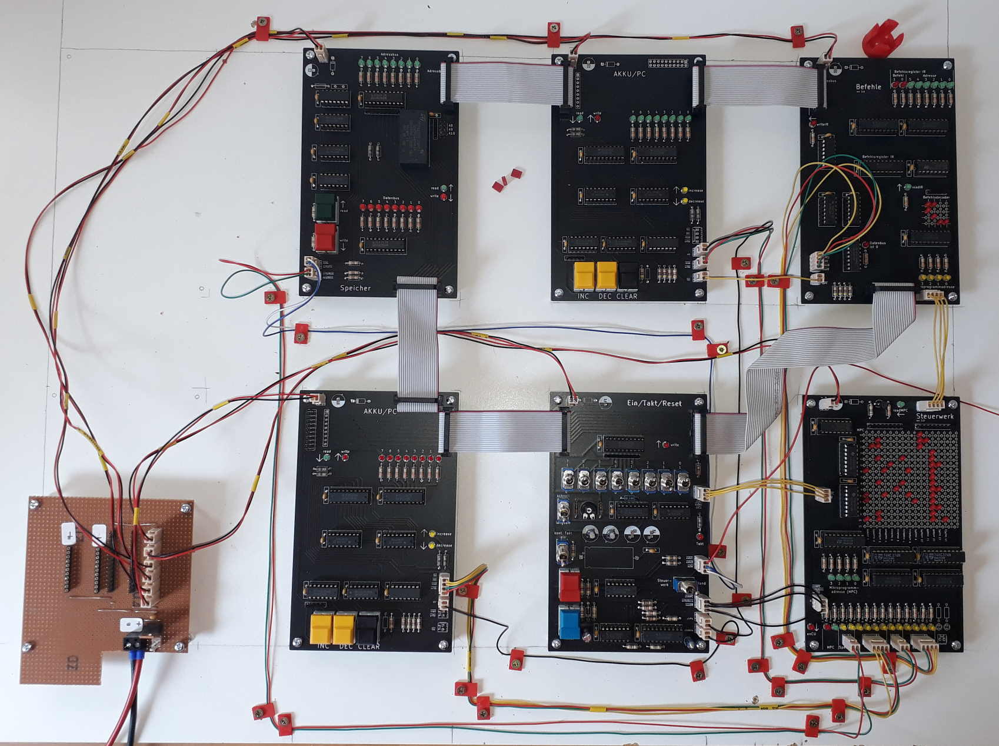

# Bonsai-Modellcomputer
Der Bonsai-Modellcomputer wurde von Klaus Merkert für den Einsatz im Informatikunterricht entwickelt. Auf folgender Seite findet man unter anderem Schaltpläne und Platinenlayouts von Klaus Merkert zum Bau eines Bonsai-Modellcomputers:
http://www.hsg-kl.de/faecher/inf/material/bonsai/

Es gibt auch eine Simulation des Lerncomputers (https://bonsai.pinyto.de/), die im digitalen Informatik-Schulbuch http://inf-schule.de verwendet wird.

Viele Bauteile, die in den Plänen von Klaus Merkert verwendet werden, wurden abgekündigt und sind heue (Stand 2021) nicht mehr verfügbar.
Ziel dieses Projektes ist es deshalb, eine Version des Bonsai-Modellcomputer zu entwickeln, die möglichst leicht nachgebaut werden kann.

# Projekstatus
Der Prototyp funktioniert und wurde im Unterricht eingesetzt. In den Github-Issues sind einige kleinere Probleme beschrieben, die vor einem weiteren Nachbau behoben werden könnten.

# Änderungen gegenüber den Plänen von Klaus Merkert
- Die Namen und Reihenfolge der Steuersignale wurden an den Simulator angepasst (vgl. https://bonsai.pinyto.de/documentation/micro/)
- Alle Schaltpläne und Platinen wurden mit der Software KiCad gezeichnet (http://kicad.org).
- Für die Platinen wurden neue Layouts entwickelt, damit die Möglichkeiten eines doppelseitigen Layouts besser genutzt werden können.
- Die Steckverbinder zur Verbindung der Steuersignale sowie der Spannungsversorgung mit den Platinen wurden ersetzt durch Reichelt PSK (Alternativ kann man Molex KK verwenden. Diese Steckverbinder sind besser, aber auch deutlich teurer).
- Alle Bauteile der Familie 74LS wurden durch Bauteile der Familien 74HC oder 74HCT ersetzt.
- Zur Nullentdeckung auf der Platine Befehle wurde eine Wired-And-Verknüpfung mit Open-Collector-Ausgängen verwendet. Diese Wired-And-Verknüpfung wurde durch Gatter in einem 74HC08 ersetzt.
- Zur Erzeugung eines automatischen Taktsignals wird ein 74HC4046 verwendet.

# Eine Bonsai nachbauen
## Platinen fertigen lassen
Die Pläne wurden mit KiCad gezeichnet. In den *.sch-Dateien befinden sich die Schaltpläne, die Platinenlayouts sind in den *.kicad_pcb-Dateien. Um die Platinen fertigen zu lassen, muss man das Platinenlayout in ein Format exportieren, dass der Hersteller versteht. In der Regel ist das Gerber. Die Gerber-Exporte, die bei dem Prototypen verwendet wurden, liegen im Verzeichnis gerber. Diese Gerber-Dateien wurden von https://jlcpcb.com/ problemlos gefertigt.

## Platinen bestücken
Es werden nur bedrahtete Bauteile (keine SMD-Bauteile) verwendet, da bedrahtete Bauteile von Lötanfängern (z.B. Schülern) leichter bestückt werden können. Es ist sinnvoll, bei allen ICs je einen Sockel zu verwenden.

## Platinen zusammenbauen
Bei der Verdrahtung kann man sich orientieren
- [am Bild des Prototypen](Prototyp.jpg)
- [Verdrahtung](Verdrahtung.svg) Tipp: Datei in Inkscape öffnen; die Datei ist im Maßstab 1:1 gezeichnet
- an der Verdrahtungsanleitung von Klaus Merkert (https://www.hsg-kl.de/faecher/inf/material/bonsai/bau/verdraht/index.php)

Crimpanleitung für die Steckverbinder Reichelt PSK: https://www.reichelt.de/reicheltpedia/index.php/Crimp_Anleitungen#Crimpen_von_PSK-Kontakten

Als Flachbandkabel kann man alte IDE-Kabel verwenden. Mann muss jedoch einige Leitungen abtrennen und neue Stecker crimpen.

Die Kabelhalter können mit einem 3D-Drucker gedruckt werden. Eine OpenSCAD-Datei befindet sich im Ordner Kabelhalter: [Kabelhalter.scad](Kabelhalter/Kabelhalter.scad)